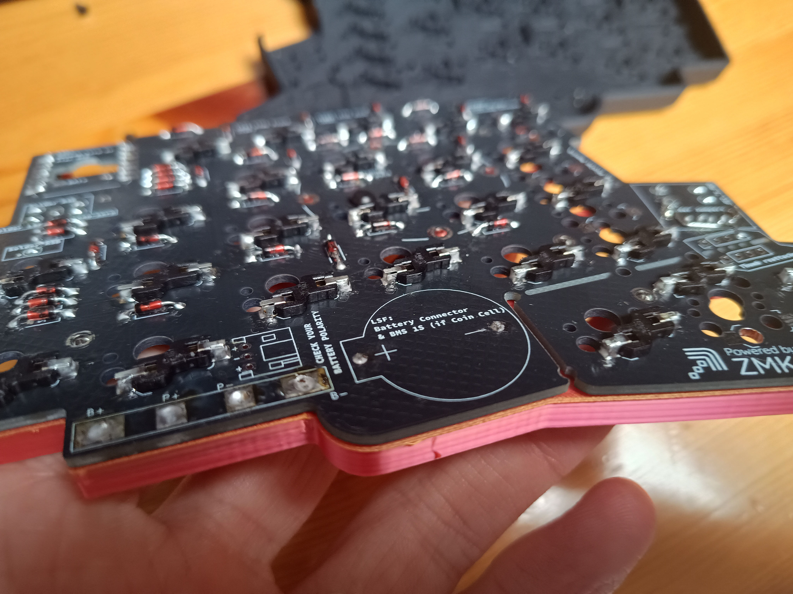
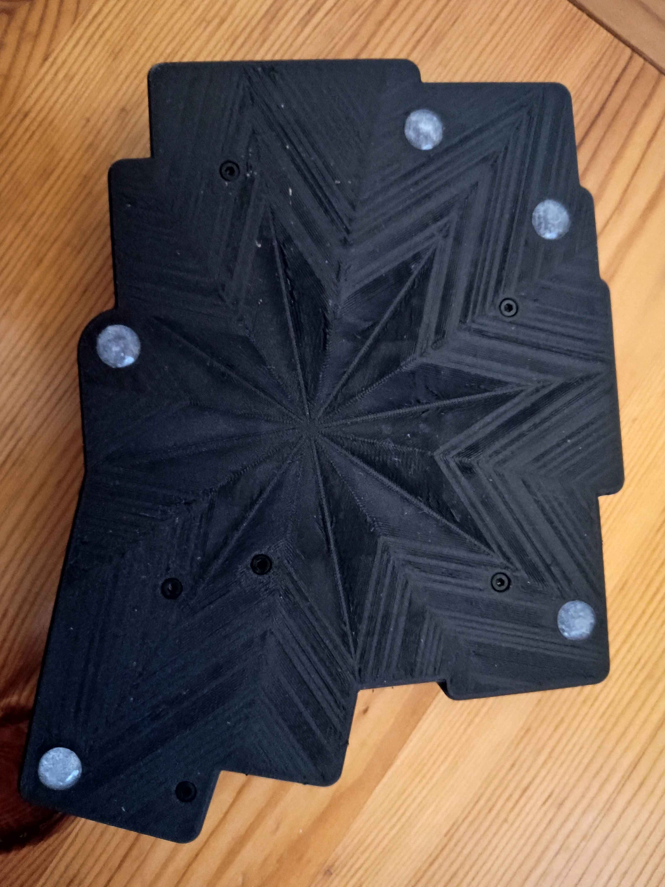

# Case Assembly Guide

Assembling the case is relatively simple, but there are a few finnicky parts. Your first task is XIAO exclusive - RP2040-Zero users can skip to the next step.

## XIAO Button

First, take the tray (with all the switch holes cut into it) You'll need to insert the button such that you can press it from the outside. This is very fiddly, you will definitely want to use tweezers.

| |
| :--: |
| *Here's the little button lying on the MCU shell* |

| |
| :--: |
| *Insert the button from the top and wiggle it around to make sure it fits nicely and moves.* |

| |
| :--: |
| *Insert the button into place. Very fiddly.* |

## Nuts

Insert the nuts into the tray. There should be 6 nuts. Keep the tray facing the the same way so that the nuts and the button don't fall out.

| |
| :--: |
| *All the nuts inserted into place and flush.* |

## PCB

Place the PCB onto the tray. Do not turn the tray over, you're sandwiching the nuts into place between the PCB and tray.

| |
| :--: |
| *PCB should lie flush on the tray.* |

| |
| :--: |
| *Insert a switch before turning it over to help keep everything in place.* |

## Frame

Place the resulting PCB+Tray into the frame, then turn it over. Screw in the screws, this can also be a bit tricky. Make sure to apply pressure from underneath so that the nut sits nicely and can bind with the screw. Finally, put the silicone bumpers into their slots.

| |
| :--: |
| *Everything should be nicely in place and secure.* |

If you have the XIAO and 1.75mm diameter transparent filament, insert some into the other hole by the MCU and then cut it flush (my tool of choice is nail clippers). You can optionally secure it in place with a tiny drop of super glue or similar. 

All done! Go flash your [firmware](https://github.com/Nick-Munnich/zmk-apiaster-module).