# Choc with RP2040-Zero PCB Build Guide

This guide assumes you have already collected all the components you need for your build from the corresponding [ordering list](../choc-ordering-guide/choc-zero.md).

**Before you begin, make sure you know how to solder. [This video](https://www.youtube.com/watch?v=3jAw41LRBxU) serves as a fantastic introduction. You can also read [this guide](https://learn.sparkfun.com/tutorials/how-to-solder-through-hole-soldering/all), but I'm not quite as big a fan of it.**

Pick up two halves of your PCB and lay them on opposite sides so that they mirror each other. At the top, you should see some text "Left Side Front (LSF)" "Right Side Back (RSB)". These are used to help you identify what to solder by looking at the PCB. Treat the sides that are currently facing you as "back", so you should have one "Right Side Back" and one "Left Side Back" facing you. If it helps, you could put a sticker or something on the back sides to help you remember which side is back and which is front (Though this should quickly become obvious once you have some components soldered).

## Step 1: Diodes

We start with the diodes because they are the fiddliest component, so it is easiest to do them while the PCB is clear of components. The images are of through-hole diodes, but SMD diodes are very similar.

### Bending diodes

Begin by bending the legs of the diodes so that they can fit through the holes on each diode position:

|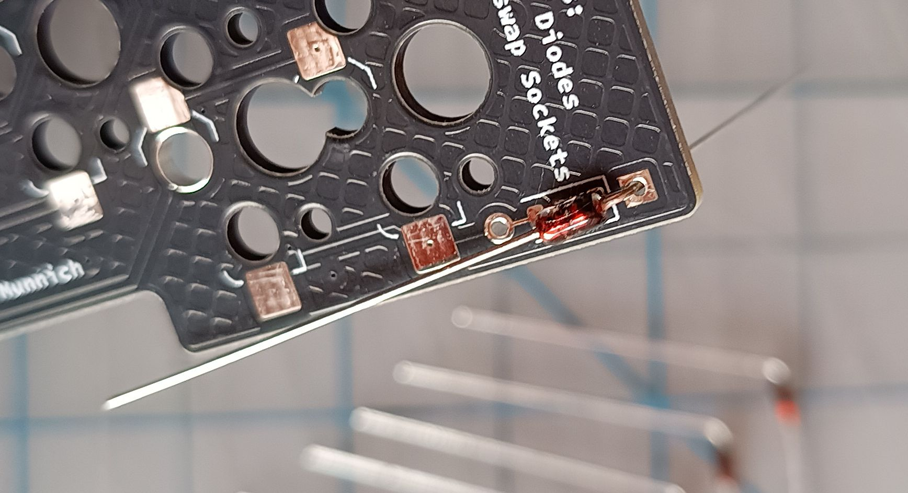 | |
| :--: | :--: | 
| *Use the PCB as a guide* | *Collect them on the side* |

As a reminder, you will need a total of 70 diodes. It makes it easier if you bend them in the same orientation, i.e. bend all the legs on the side with the black stripe.

### Insert diodes

Insert the diodes onto the PCB so that the diode is resting on the **back** sides of both halves. Insert them wherever you see the diode markings on the PCB. **Do not insert any diodes on the front side, all diodes will be on the same side**. Make sure you insert them in the correct orientation, as in the image.

|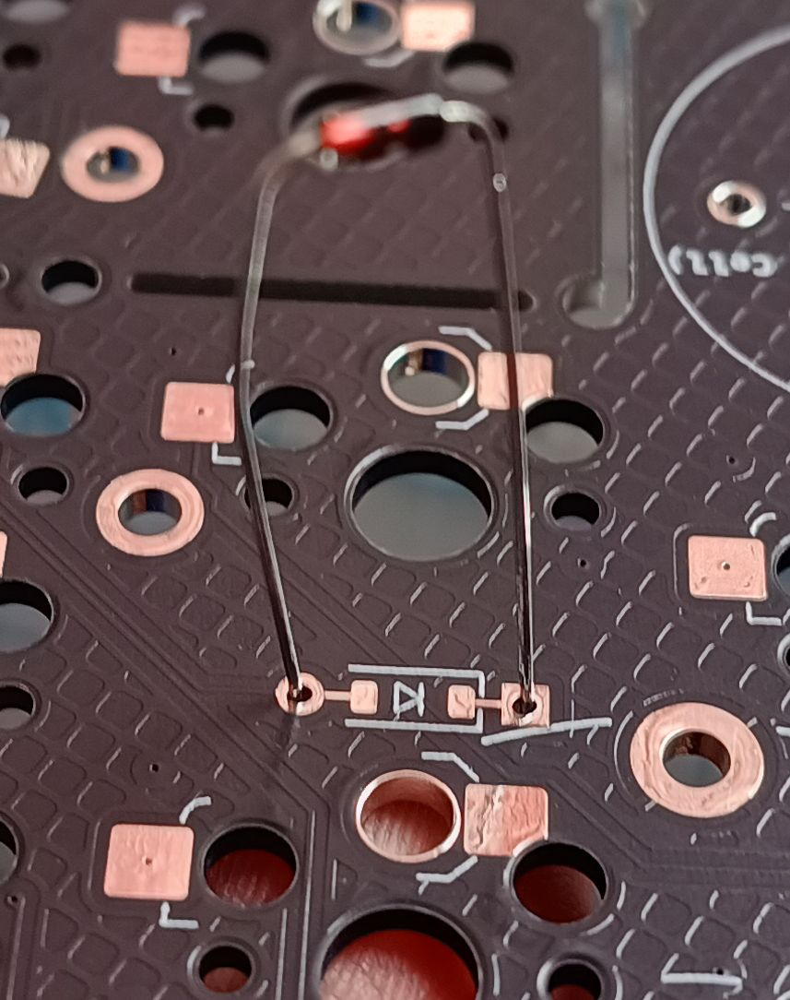 |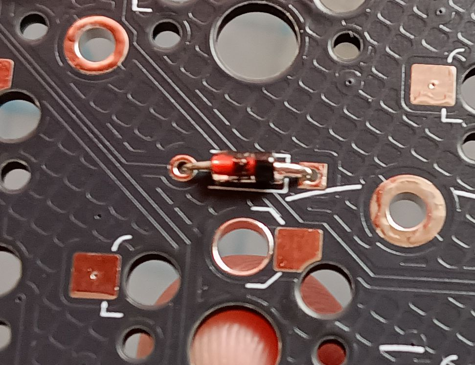 |
| :--: | :--: | 
| *Bend the other leg as you insert the diode* | *Should look like this when done* |

Once you have the diode inserted, flatten the legs on the other side to hold it in place. 

|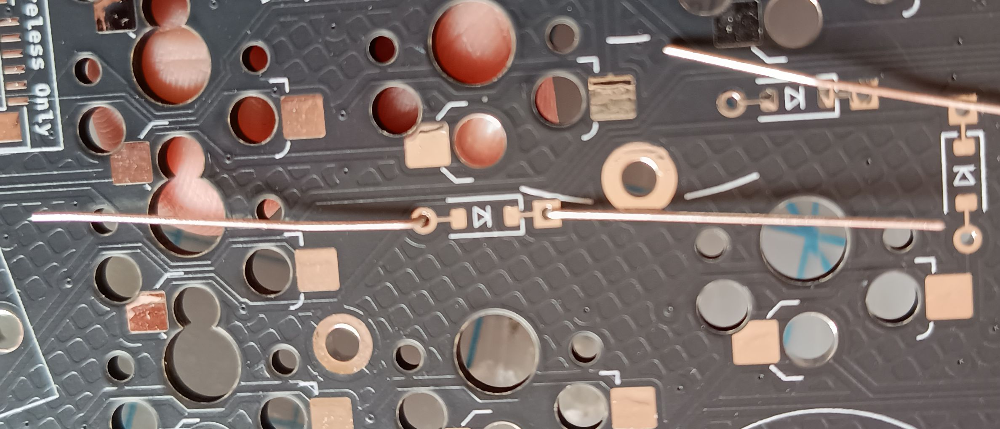 |
| :--: |
| *Take your time!* |

Double-check that the orientation of your diode is correct.

|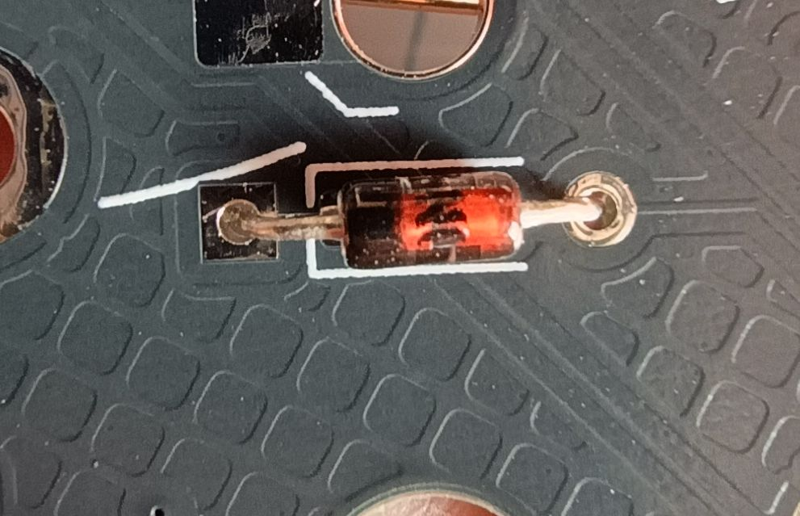 |
| :--: |
| *I like to think of the markings as a water glass and the black line needs to be at the bottom of the glass* |

The PCBs should look like this once you've inserted all the diodes.

|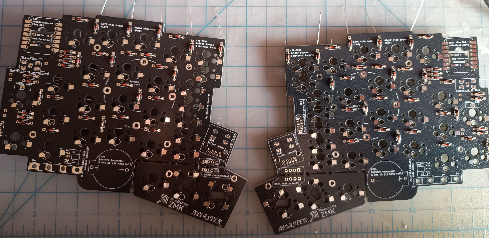 |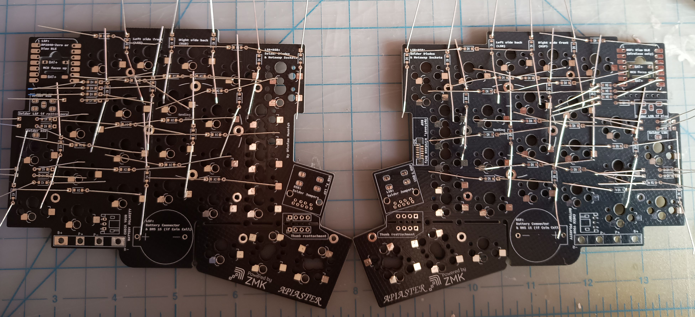 |
| :--: | :--: | 
| *All diodes inserted into the back sides* | *Bent legs on the front sides* |

Orient the PCBs to that the back side of each is facing you, then solder the diodes.

|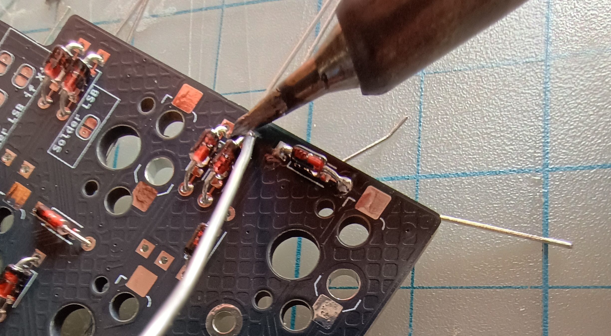 |
| :--: |
| *This wasn't actually me soldering, holding the camera made that too difficult. Use a better orientation when soldering.* |

Finally, use your wire cutters to clip the legs off all the diodes.

| |
| :--: |
| *I recommend holding something above the wire cutters or wearing eye protection, those legs can jump! Cut as flat as you can without damaging the PCB.* |

## Step 2: Soldering Jumpers

There are a handful of jumpers that you need to solder. 5 on LSF, 5 on LSB, 10 on RSB. On each PCB there should be 5 near the MCU, 4 near the USB, and one near a switch under the MCU.

**WARNING: If you solder the jumpers wrong, then this might damage your MCU when you plug it in. Please doublecheck that you are closing the right ones.**

On the USB-A socket, close *all* the jumpers on the **opposite** side to the USB connector. This should be the **same** side as the diodes and hotswap sockets.

There is a single jumper far under the MCU near a switch with the text "Solder LSB" or "Solder RSB". Solder these on the back sides as stated, the **same** side as the diodes, **opposite** side to the MCU.

Finally, the 5 jumpers for the MCU just underneath it. On the PCB that you have designated as the right hand side, solder the jumpers on the **same** side as the diodes, just like all the other jumpers.

However, on the left side, which side you solder depends on your MCU:

* XIAO: Solder the jumpers on the **same** side as the diodes, just like all the other jumpers.
* RP2040-Zero: Solder the jumpers on the **opposite** side as the diodes, the same side as the switches will be. These are the **only** jumpers which should be soldered on the front side. If you solder these jumpers, do not solder the corresponding jumpers on the back for the XIAO.

|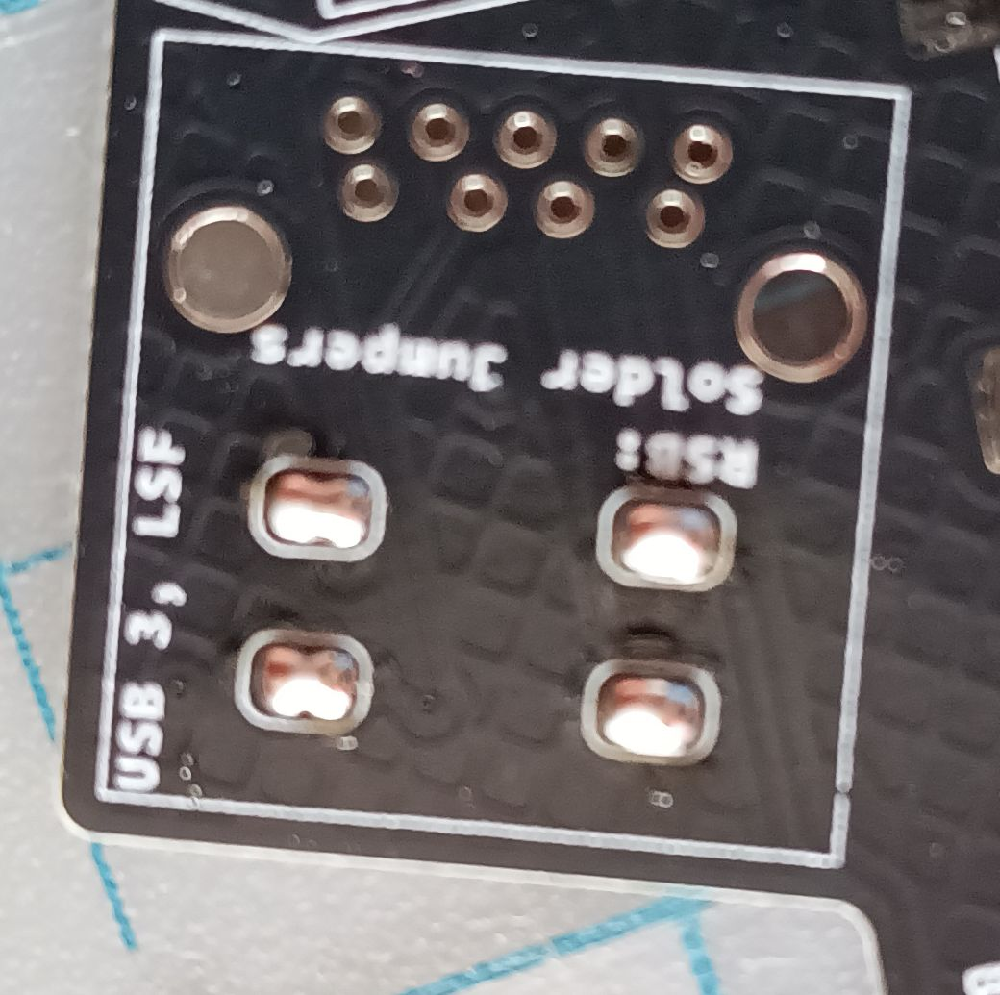 |
| :--: |
| *Essentially just a blob of solder connecting the two bits. Make sure you're heating both at the same time if you're struggling to get it to bridge. Add flux if it's not smooth.* |

## Step 3: Adding Hotswaps

One by one, place the hotswap sockets and solder them in place. **Note that if you are using choc hotswap sockets, you will need to decide on your inner key positions now, as the hotswaps will otherwise block the switches from being inserted.** Also note that if you only have 50 (or fewer) you should pick and choose which hotswap sockets to solder based on your desired switches. There is no conflict with the thumbs, you can solder all the hotswap sockets there.

| |
| :--: |
| *All the hotswap sockets for the full inner key column and standard 1u thumb cluster. Ignore the bad soldering job, I was unwell at the time. I redid them later on.* |

The "Ripple" thumb cluster uses the hotswap sockets in the "correct" orientation, while the standard 1u sized ones use the "upside down" ones.

Soldering tip: Hold the soldering iron to the side of the socket, touching the pad underneath with the tip. Add a drop of solder to the iron to help with thermal conductivity, then feed the solder **into** the socket. Then, obviously, remove the solder wire, wait for it to settle, then remove the iron.

## USB A Connectors

Skip this step if it doesn't apply to you.

If your choices result in you using a USB A 3.0 connector to connect the halves, then this is what you should solder next. Put it on the *front* side and press it into the holes until it clips into place (this might be a bit fiddly).

Solder all of the pins. You do not need to solder the clips, though you *can* if you wish.

| |
| :--: |
| *USB socket, soldered. Note that your closed jumpers should be on the side **opposite** the USB connector.* |

*Disclaimer: I made a minor error in the first revision of the PCB and had to use some bodge wires with the usb connector. The error should be fixed in the current version, but this disclaimer will be kept until that is confirmed.*

## Batteries

Skip this step if using RP2040-Zero.

While inserting the battery will be the *last* step that you do, now is a good time to solder the battery parts.

### Coin Cell

For the coin cell connector, stick the connector through the holes so that the connector is resting on the *front* following the markings on the PCB, then turn it over and solder the connectors.

|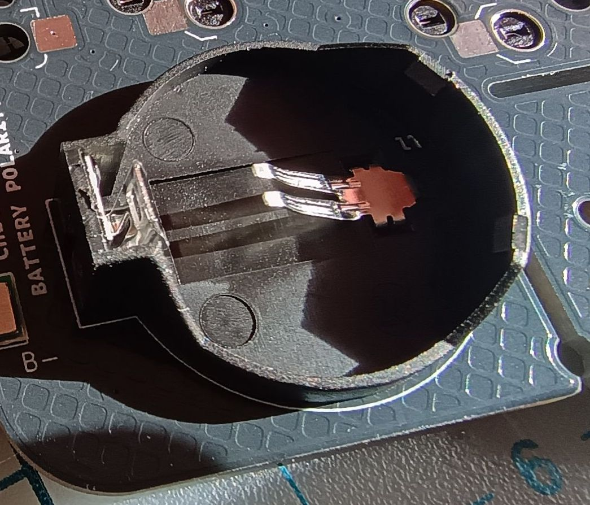 |
| :--: |
| *Solder the two pins on the other side.* |

There is a decent chance that the connection won't be flush. If this happens, press the connector into the PCB while applying a bit of heat to the pin that's sticking out.

|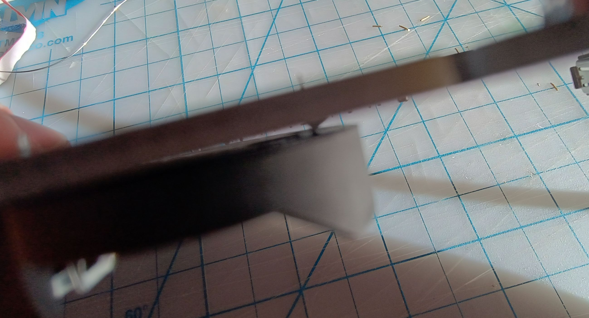 |
| :--: |
| *This gap shouldn't be there.* |

You'll then need to solder the BMS 1S battery protection circuit onto the *front* side as well.  **Make sure the text on the PCB matches up with the text on the BMS 1S, B+ to B+, B- to B-, etc.**

| |
| :--: |
| *I tried doing this with some electrical tape, and it did not work out for me, so I'm recommending crocodile clips or similar be used. Note that my silkscreen for the battery connector in this image is the wrong way around - B+ is the side closest to the coin cell. This was fixed in the published version.* |

Turn the pcb over and feed solder into all the holes to form a good solid connection between PCB and BMS 1S. This is likely the trickiest part of the build, hopefully you'll have had a good amount of practice soldering by now.

### LiPo

For this battery type, you'll want to solder on the JST PH header. Insert it onto the *front* side, making sure that the pins match the orientation of your battery's cables - use a multimeter to confirm the orientation if you're uncertain. If you purchased a 3 pin socket, then you will need to do this when inserting the battery instead. **Reverse polarity is dangerous.**

## Step 5: Multimeter Verification

Take a moment to verify that everything is correct. If you have a multimeter, take it out and put it on continuity mode. 

### Choc:

|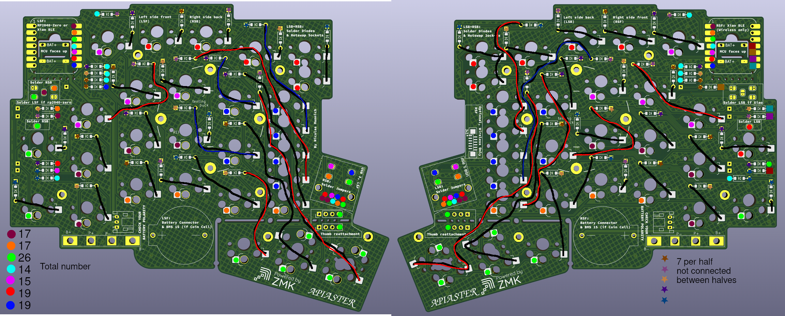 |
| :--: |
| *Infographic to help verify the connections for the **RP2040-Zero** setup.* |

| |
| :--: |
| *Infographic to help verify the connections for the **XIAO nRF52840** setup.* |

MX:

| |
| :--: |
| *Infographic to help verify the connections for the **RP2040-Zero** setup.* |

|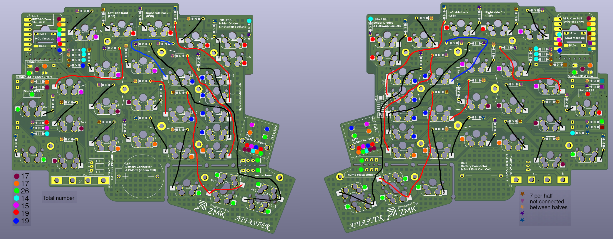 |
| :--: |
| *Infographic to help verify the connections for the **XIAO nRF52840** setup.* |

Plug the USB A 3.0 cable into both halves, and turn it over so that the **back** is facing you. You can then probe continuity according to the above graphic for your choice of MCU - any connections with the same shape and color should have continuity. Probing the battery-related bits can be done using the markings on the PCB directly.

## Step 5: MCU

Next, you'll want to prepare your MCU's sockets. **If you are SMD mounting the MCU, skip to the next step, then solder your MCU on afterwards.** If you haven't already and are using round-hole sockets, use pliers to yank out the pins.

My approach is to use a breadboard to stick the sockets in, then insert the pins into the sockets. Then solder the MCU to the pins, and finally use the MCU as a guide to solder the sockets to the PCB.

An alternative strategy to making sure the sockets are straight which doesn't use a breadboard can be found [here](https://github.com/zzeneg/molekula/blob/main/keyboards/Molekula2/README.md#central).

| |
| :--: |
| *Insert the sockets into the breadboard, insert the pins and push them down so that they are seated. Some use a line of (electrical) tape over the sockets to prevent any solder from connecting the pin to the socket - do so if you're inexperienced.* |

| |
| :--: |
| *Insert your MCU of choice. For the RP2040-Zero, note that **you are only using the topmost 7 pins**.* |

|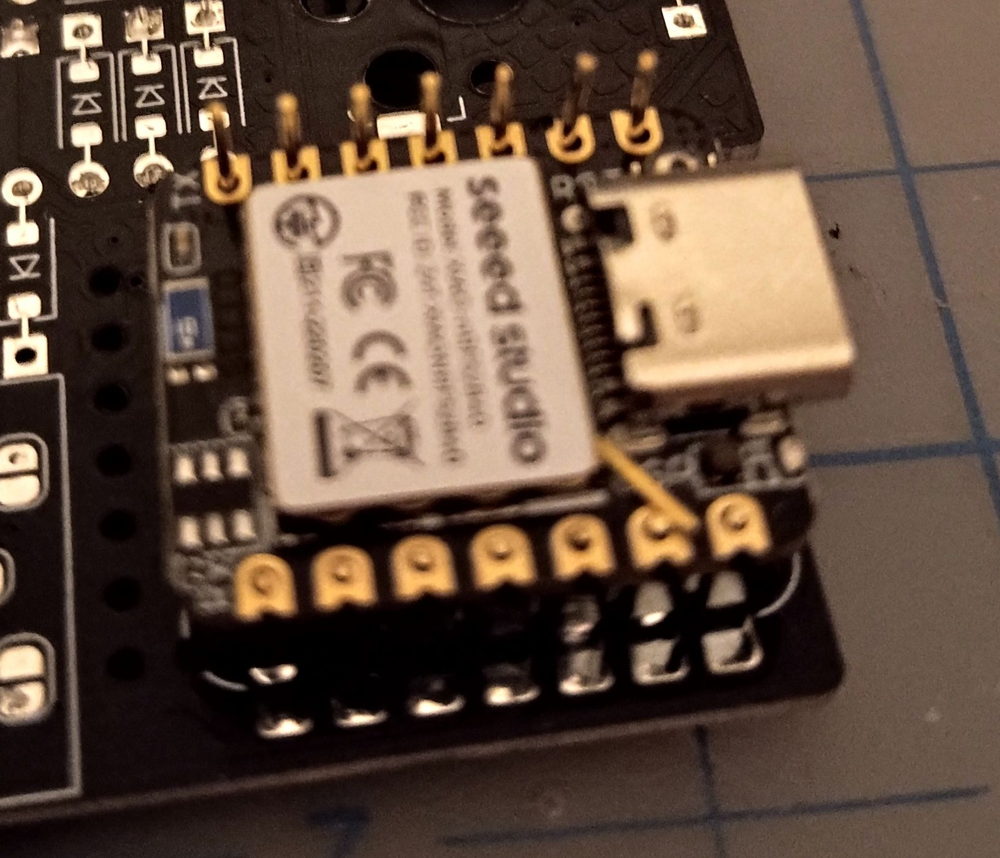 |
| :--: |
| *Clip the legs off before soldering. They need to be nice and flat for the case.* |

|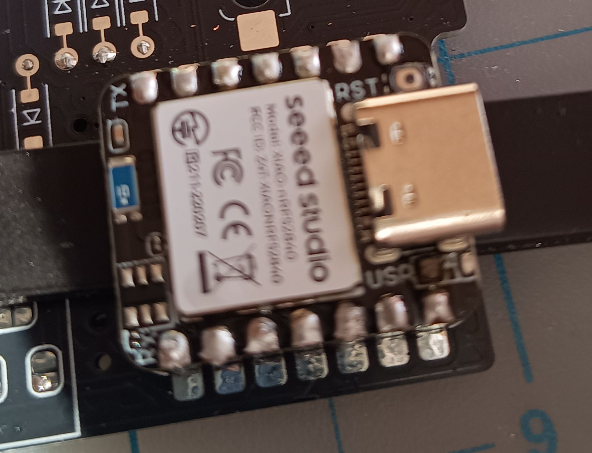 |
| :--: |
| *Solder the pins onto the MCU.* |

|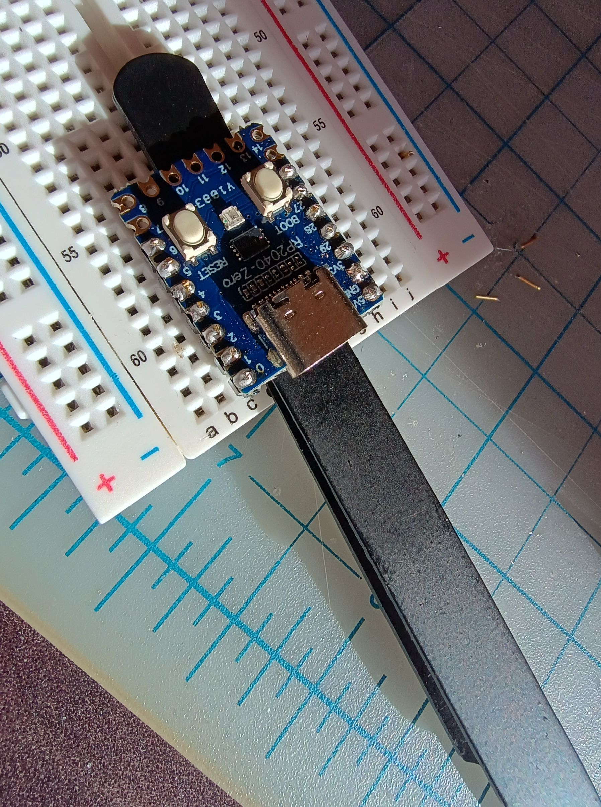 |
| :--: |
| *Use your tweezers or something else to wedge the mcu up and away from the breadboard. Don't worry if the sockets come with, you want them to be on the MCU for now.* |

If you are using the RP2040-Zero, you want to solder the pins and MCU to the **left half only**. Same if you are using a singular XIAO. If you have two (or more) XIAOs, add the MCU to both halves.

|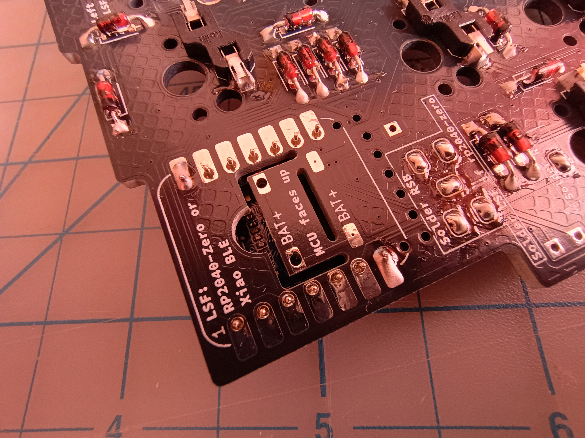 |
| :--: |
| *Insert the sockets into the PCB, using the MCU as a guide, then solder them.* |

## XIAO Battery Connection

The XIAO's B+ pad will need to be connected to the PCB. The B- pad can be ignored, it is already connected through one of the other pins. Begin by removing the XIAO from the socket using the wedging technique again, the female sockets should stay as you soldered them in place.

| |
| :--: |
| *Should look like this. Obviously skip this step if you are SMD mounting.* |

If you are using pogo pins for the battery connector, place a pogo pin through the below marked hole and then solder it into place from the other side.

|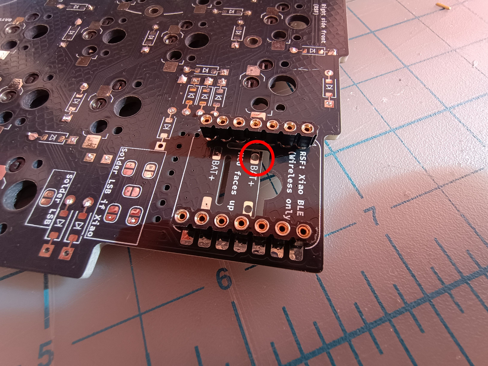 |
| :--: |
| *Pogo pin goes here. You can replace the XIAO once this is done. This should *not* be mirrored on the other side, doublecheck where the B+ pad is located if you are uncertain.* |

For all other mounting approaches, I recommend using a diode leg. First, apply a bit of electrical tape to the XIAO's B- pad. This is to avoid shorting B+ and B-.

| |
| :--: |
| *Tape covers up B-.* |

Next, take one of your spare diode legs that you clipped off and solder it to the B+ pad.

|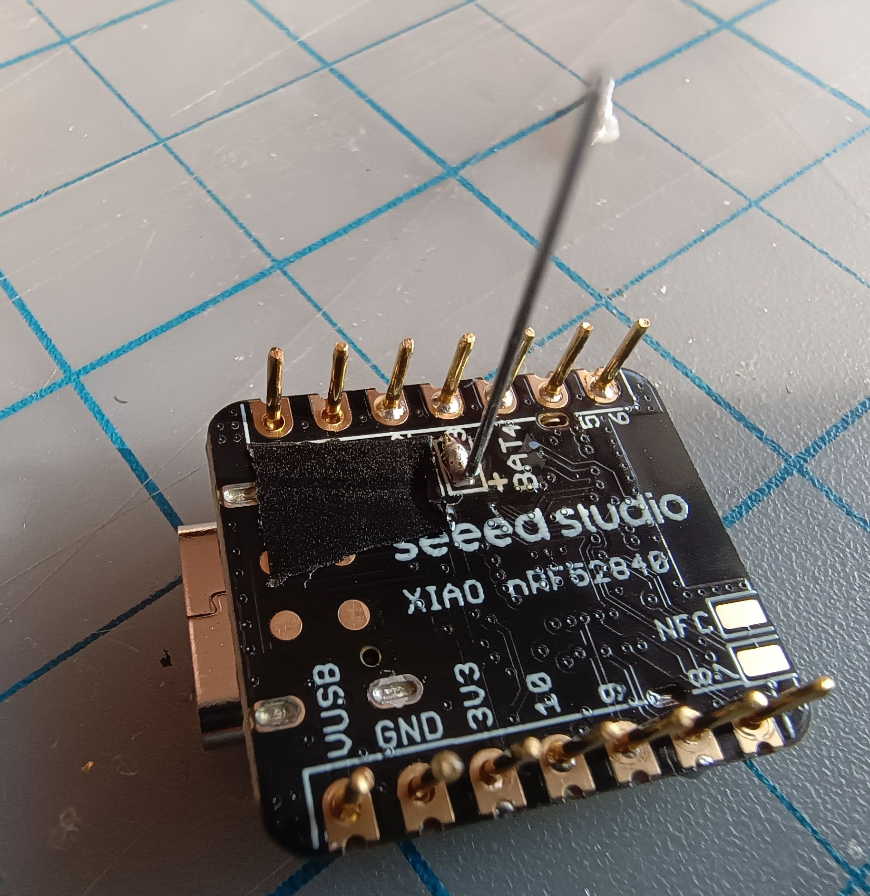 |
| :--: |
| *Curved bit goes towards MCU, it's easier that way.* |

Going back to the PCB, snap off this little tab using a pair of pliers or similar:

|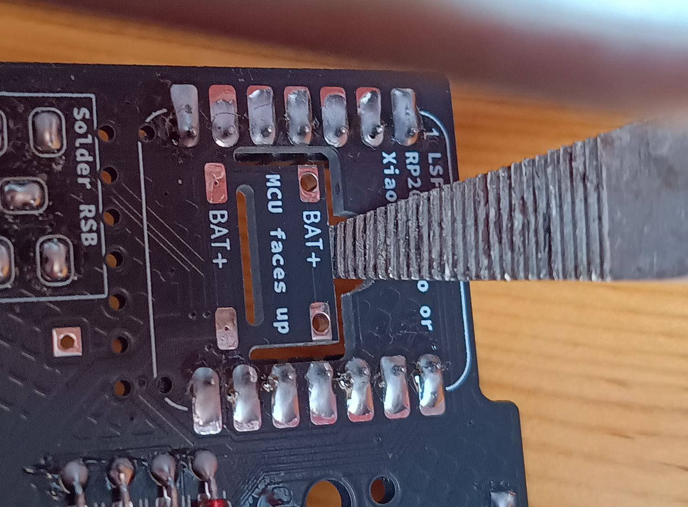 |
| :--: |
| *Snap this off* |

|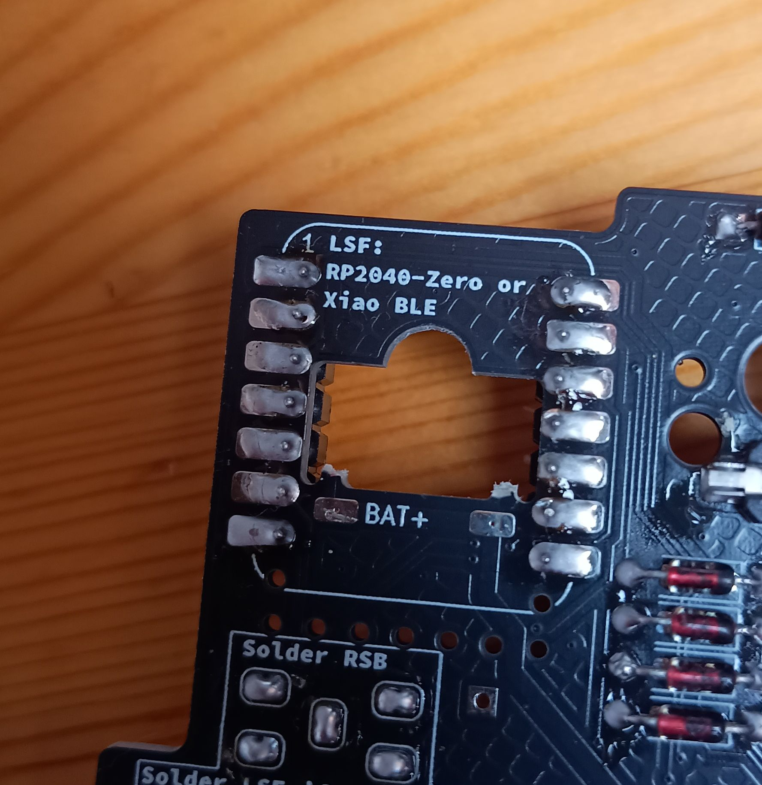 |
| :--: |
| *Resulting hole* |

Insert your MCU back into the sockets. The diode leg should stick out through the hole. You can then solder it to either of the spare B+ pads, clipping off the excess leg.

|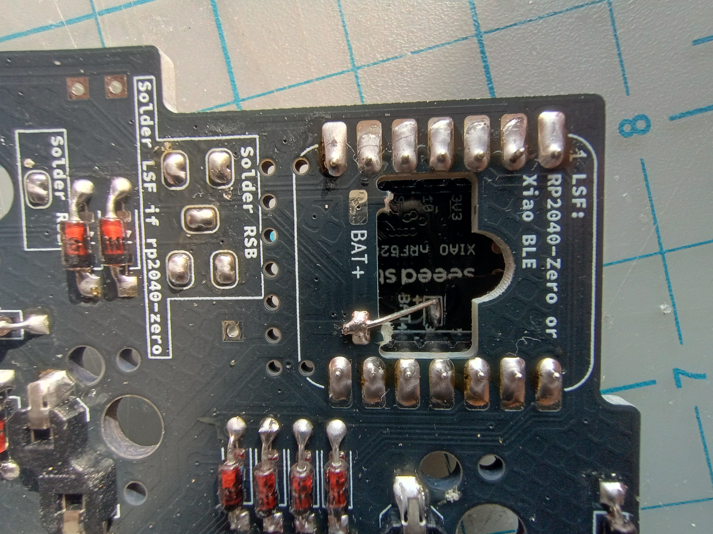 |
| :--: |
| *Soldered diode leg.* |

If you ever need to swap the MCU, just cut the diode leg in half first. You should have *plenty* of spares.

# Optional: Thumb Cluster

If you want to move the thumb cluster, simply snap it off and then solder wires to the marked holes. The wires should all be parallel, no crossing between them.

Make sure you solder so that the wires are on back of the PCB, the same side as the hotswap sockets. 

# Finished

You're essentially done now, barring the insertion of switches into the hotswap sockets. You can continue by [following the case guide](../case.md) to build your case, or proceed straight to [firmware](https://github.com/Nick-Munnich/zmk-apiaster-module) to get it up and running.
